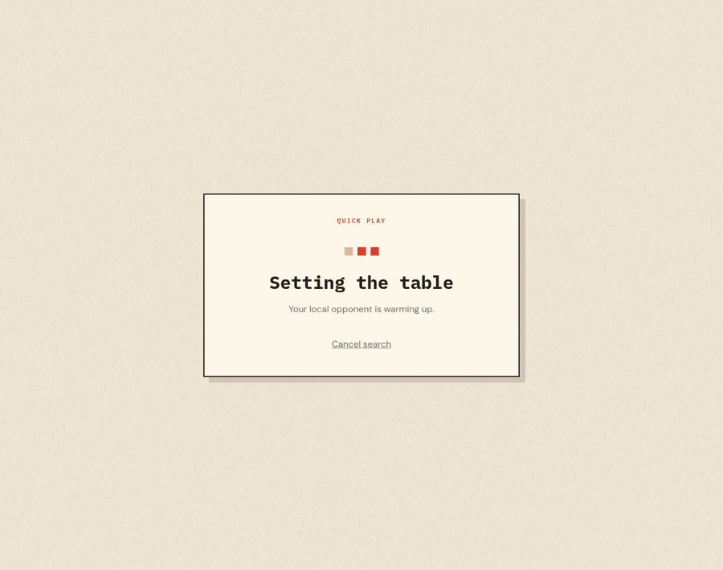
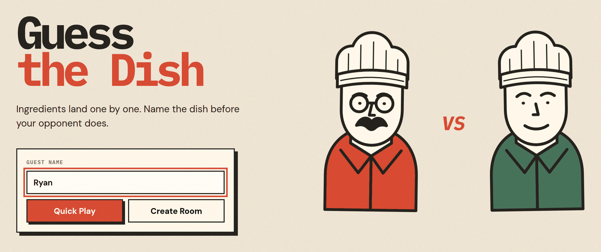
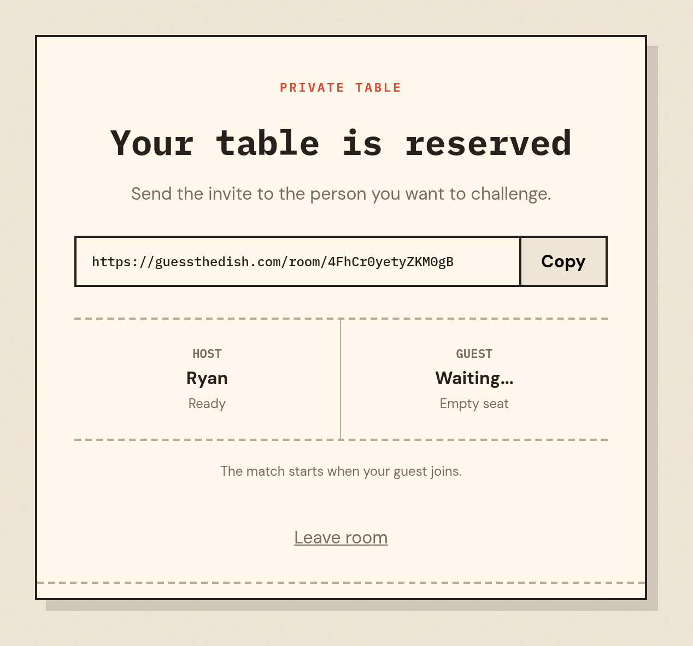
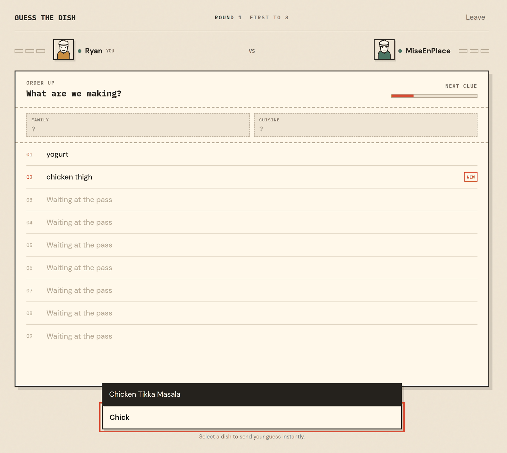
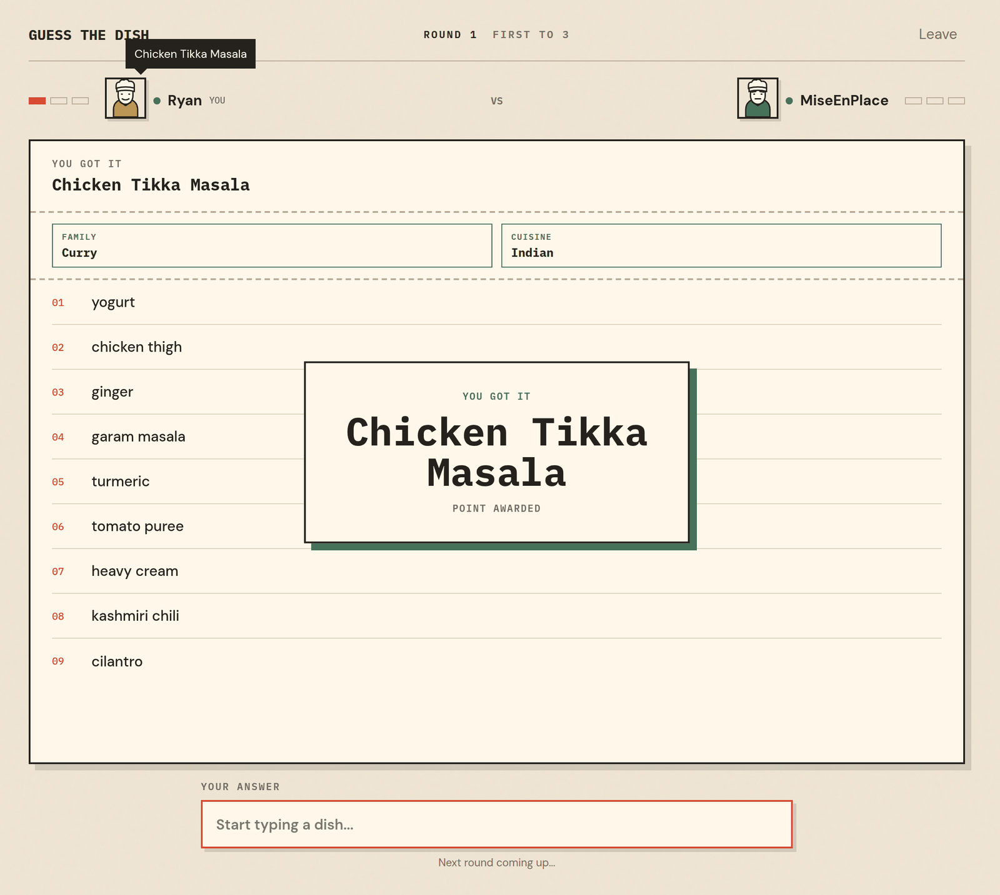

<div align="center">

# Guess the Dish

**Ingredients land one by one. Name the dish before your opponent does.**

No account. No install. Type a guest name and you are playing.

### [▶ Play at guessthedish.com](https://guessthedish.com/)

[Report a bug](https://github.com/ryanata/guessthedish/issues/new?template=bug_report.yml) ·
[Request a feature](https://github.com/ryanata/guessthedish/issues/new?template=feature_request.yml) ·
[Flag a wrong dish](https://github.com/ryanata/guessthedish/issues/new?template=puzzle_feedback.yml)



</div>

## The game

Two players, one dish, and a list of ingredients that arrives one item at a time. The whole game is
a single decision made over and over: **guess now on thin evidence, or wait for a more distinctive
ingredient and risk losing the race.** `olive oil, onion, red pepper` could be a hundred things.
Four clues later it can only be one.

## The rules in ten seconds

- **First to 3 rounds** wins the match.
- Answers come from a **fixed dish catalog**, so there are no spelling arguments and no typing prose.
  Search, pick, and it submits instantly.
- Clue reveals are **server-timed and identical for both players**, so the race is real: five seconds
  between the early ingredients, seven and a half later on.
- A wrong answer costs a **300 ms lockout**. You keep typing, you just lose tempo.
- Two hints unlock as the clues pile up — the **dish family** halfway through, the **cuisine** three
  quarters in. No first letters, no word lengths. If nobody gets it, nobody scores.

## Two ways to play

**Quick Play** matches you with whoever is waiting. If nobody turns up within three seconds, a bot
takes the seat, so you never sit in an empty lobby.



**Create Room** reserves a private table behind a link nobody can guess. Share it, and the match
starts the moment your guest sits down — bots never fill an invite room.



## A round, in pictures

Ingredients stack up while the timer bar runs down. Start typing and the catalog narrows to the
dishes that match; `Enter` sends the highlighted one straight to the server.



Whoever lands the right answer first takes the point. The dish, the full ingredient list, and the
score all land together, and three seconds later the next dish is on the pass.



## Found a bug? Want something changed?

**This repo is the right place for all of it** — bugs, ideas, and dishes you think are unfair. Every
report gets read, and a two-line note beats a bug nobody knows about.

| I want to... | Do this |
| --- | --- |
| Report something broken | [Open a bug report](https://github.com/ryanata/guessthedish/issues/new?template=bug_report.yml) |
| Suggest a feature or a game-rule change | [Open a feature request](https://github.com/ryanata/guessthedish/issues/new?template=feature_request.yml) |
| Flag a wrong, unfair, or missing dish | [Open dish feedback](https://github.com/ryanata/guessthedish/issues/new?template=puzzle_feedback.yml) |
| Ask a question or float an idea first | [Browse existing issues](https://github.com/ryanata/guessthedish/issues) and add to one |

Useful things to include in a bug report: what you expected, what happened, the round or dish it
happened on, and your browser and device. Screenshots and recordings are very welcome.

## Run it locally

The project is a React + Vite client and a Go server that owns every rule, timer, and score.

```sh
npm install                 # client dependencies
npm run build               # build the client into dist/
CONTENT_PATH=./puzzles.json go run ./cmd/server
```

Then open <http://127.0.0.1:8080>. Quick Play fills the second seat with a bot after three seconds,
so a single browser tab is enough to play a full match. During UI work, `npm run dev` gives you Vite
with hot reload alongside `npm run dev:server`.

| Variable | Default | Purpose |
| --- | --- | --- |
| `ADDR` | `127.0.0.1:8080` | Listen address |
| `CONTENT_PATH` | `../guessthedish-data/data/puzzles.json` | Puzzle bundle to load at startup |
| `DIST_PATH` | `dist` | Built client to serve; API and health endpoints work without it |

Production puzzles live in a separate private repository so the answers stay out of the public
client bundle, so bring your own content file to run locally. It needs at least five puzzles, each
with 4–12 clues:

```json
{
  "version": 1,
  "puzzles": [
    {
      "id": "shakshuka",
      "name": "Shakshuka",
      "aliases": ["eggs in purgatory"],
      "family": "Egg",
      "cuisine": "North African",
      "difficulty": "intermediate",
      "clues": ["olive oil", "onion", "red pepper", "cumin", "paprika", "crushed tomatoes", "eggs", "feta"]
    }
  ]
}
```

Order the clues from least to most identifying — that ordering is what makes a round a race instead
of a lookup.

## Contributing

Small, focused pull requests are welcome. Open an issue first for anything that changes game rules,
timing, or the visual system, since those are deliberate design decisions rather than accidents.

Before opening a pull request:

```sh
npm run lint                # client lint
go test ./...               # server tests
```

The Go server is server-authoritative and standard-library-only: it decides which correct answer
arrived first, and clues, answers, and bot decisions never reach the browser early.

## HTTP API

<details>
<summary>Endpoints, authorization, and snapshot fields</summary>

- `GET /healthz` and `GET /readyz`
- `GET /metrics` exposes Prometheus text-format request, match, and process metrics.
- `GET /api/catalog` returns `{ "dishes": [{ "id", "name", "aliases" }] }`. The catalog is safe to
  publish because it lists every possible answer, never the current one.
- `POST /api/matches` with `{ "name": "Guest" }` joins the oldest waiting human or creates a waiting
  match. The response includes that seat's opaque `token`.
- `POST /api/rooms` with `{ "name": "Host" }` creates a private waiting room and returns its snapshot
  with a 96-bit URL-safe `roomCode` and the host seat's opaque `token`.
- `POST /api/rooms/{roomCode}/join` with `{ "name": "Guest" }` claims the second seat and starts
  round one. Unknown codes return `404`; occupied rooms return `409`.
- `GET /api/matches/{id}` advances lazy timers and returns the current snapshot. If the first player
  has waited at least three seconds, this authenticated request fills the opponent seat with a bot
  and starts round one.
- `POST /api/matches/{id}/guesses` with `{ "dishId": "pad-thai" }` submits a catalog selection.
- `DELETE /api/matches/{id}` cancels a waiting match or deletes an active match for both seats.

Private rooms remain waiting indefinitely while retained, never receive a bot, and are excluded from
Quick Play matchmaking. After joining, both room seats use the normal match-ID endpoints above.

All match-specific requests must present that seat's opaque token as an HTTP bearer credential in
the `Authorization` request header; missing or invalid tokens return `401`. Tokens are returned only
by the successful creation/join response. Snapshots are oriented to
the token's seat and use `player` and `opponent`; `opponent.isBot` identifies fallback play. `phase`
is `waiting`, `playing`, `result`, or `finished`. Winners are `player`, `opponent`, or `none` from
each seat's perspective. Other fields include scores/names/latest visible guesses, stable
non-conflicting `avatar` descriptors, revealed `clues`, `totalClueCount`, and RFC3339Nano absolute
`nextRevealAt`, `deadlineAt`, and seat-specific `lockUntil` values where applicable. `answer`, all
clues, and `roundWinner` appear only after a round ends; `matchWinner` appears when a player reaches
three. API failures use `{ "error": { "message": "..." } }`.

</details>
